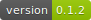
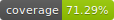

badger
======
|version| |coverage|

Commandline Interface to create svg badges.

Install
-------

.. code:: bash

    pip install badger

Usage (Commandline)
-------------------

Simplest use case of static label and value:

.. code:: bash      

    badger version v0.1.2

Percentage mode, with color picked relative to where in the 0-100 range
the value is.

.. code:: bash

    badger -p coverage 71.29%

Usage (Package)
---------------

.. code:: python

    from badger import Badge, PercentageBadge

    badge = Badge("version", "v0.1.2")
    badge.save("examples/version.svg")

    percentage_badge = PercentageBadge("coverage", 71.29)
    badge.save("examples/coverage.svg")

Disclaimer
==========

Code originally heavily copied from https://github.com/dbrgn/coverage-badge . Badge
design originally from https://github.com/badges/shields

    

